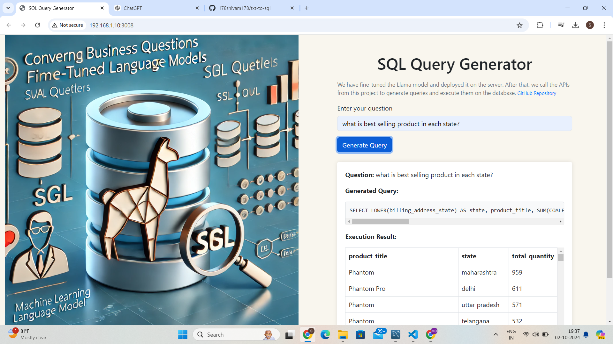

# Project Overview: Converting Business Questions into SQL Queries with Fine-Tuned Llama Models

The core goal of this project is to translate business-related natural language questions into SQL queries, execute them on a company's database, and present the results in a user-friendly UI. This solution allows non-technical users to interact with a database using natural language, automating the process of generating SQL queries aligned with specific business domains.

## Example Questions
- "What is the best-selling product in each state?"
- "What is the net revenue in the last year?"

By using this system, users can ask questions in plain language, and the underlying model will generate and execute the SQL query on their database, returning accurate results.

---

## Approach

### Initial Attempt with GPT Models
#### Challenges:
1. **Cost of Lengthy Prompts**:  
   Using GPT required a comprehensive prompt that included detailed database schema descriptions (e.g., column names, data types, relationships). This made the prompt around 1800 words long, which significantly increased the cost of each API call, leading to inefficiencies.
   
2. **Domain-Specific Query Generation**:  
   GPT models, being general-purpose, often generated incorrect or irrelevant SQL queries. Their lack of deep understanding of specialized business databases resulted in random and imprecise queries, making them unreliable for this specific application.

---

### Fine-Tuning Llama for Domain Adaptability
To overcome the challenges faced with GPT, the project shifted to fine-tuning the Llama models, which proved to be more cost-effective and adaptable for domain-specific tasks.

#### Key Constraint: Data Availability
One major challenge in fine-tuning language models is the availability of domain-specific data. To address this, we developed a **data generation pipeline**.

#### Data Generation Pipeline:
1. Domain experts created business-related questions and corresponding SQL queries.
2. GPT was used to generate additional question-query pairs, focusing on business contexts.
3. Each generated query was executed on the actual database to ensure correctness. If the query returned valid results, the question-query pair was added to the training dataset; otherwise, it was discarded.
4. **GEMINI**, another data generation tool, was also used to produce question-query pairs following the same validation process.

#### Generated Dataset:
- The pipeline resulted in a dataset of approximately **2,500 high-quality question-query pairs**.
- Queries that failed to execute or return valid results were excluded from the final dataset.

---

### Fine-Tuning Process
Several versions of the Llama model were fine-tuned using the generated dataset:
- **Llama 3-8B**
- **Llama 3.2-1B**
- **Llama 3.2-3B**
- (LLAMA 3-8B): Trained with a quantized model using LoRA configurations (lora_alpha=256, lora_dropout=0.1, r=32) on dual T4 GPUs, achieving 94% query success.
- (LLAMA 3.2 1B): Fine-tuned an unquantized model with similar LoRA settings on a P100 GPU, reaching 82.5% query success.
- (LLAMA 3.2 3B): Fine-tuned an unquantized model with similar LoRA settings on a P100 GPU, reaching 90.5% query success.

After fine-tuning, the models exhibited high domain adaptability and produced SQL queries with an accuracy of over **90%** when tested on this specific dataset.

---

## Why Not GPT?

Despite using GPT for initial data generation, it was not used for the final task due to several reasons:

1. **Cost**:  
   GPT's cost, especially for lengthy prompts with detailed database schema descriptions (around 1800 words), was prohibitive. Each API call was expensive, making it unsuitable for continuous use in this project.

2. **Execution-Based Validation**:  
   GPT-generated queries were validated by executing them on the database. While it was useful for data generation, GPT's inability to consistently generate correct SQL queries without long prompts made it less reliable for direct usage in query generation.

3. **Domain-Specific Accuracy**:  
   Fine-tuning Llama for domain-specific tasks proved to be more accurate and cost-effective, producing reliable SQL queries aligned with the company's business logic.

---

---

## Environment Setup

To create and activate the environment, follow these steps:

### 1. Create Conda Environment

create env 

```bash
conda create -n ttosql python=3.10 -y
```

### 2. Activate Environment

```bash
conda activate ttosql
```

### 3. install the requirements

```bash
pip install -r requirements.txt
```

### 4. SET your database and llama URL
Change .env

### 6. Run api.py 

```bash
http://127.0.0.1/3008
```
----

## Conclusion
The fine-tuned Llama model provides a highly accurate, cost-effective solution for converting natural language business questions into SQL queries, particularly for domain-specific databases. By utilizing a data generation pipeline, we created a robust dataset for training, and the resulting fine-tuned Llama models achieved over **90% accuracy** in generating valid SQL queries.

This approach resolves the limitations faced with GPT, such as high costs and inaccurate query generation, while leveraging GPT and GEMINI for data creation. Fine-tuning Llama offers an optimal solution for reliable and efficient SQL query generation based on natural language inputs.
